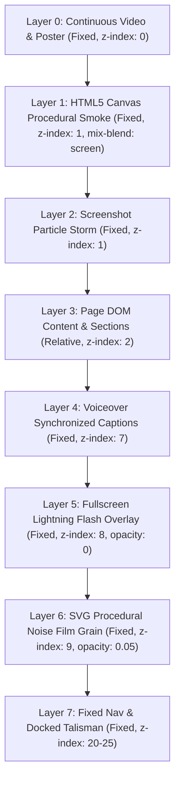
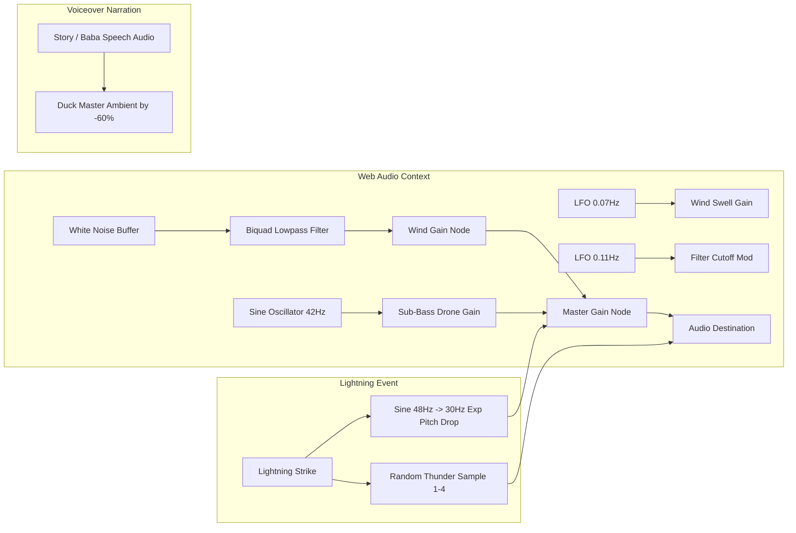

# Digital Dropouts (Skills to Bills) — Complete Architecture & Style Clone Blueprint

A comprehensive forensic analysis and implementation guide for cloning the visual aesthetic, motion physics, audio engineering, and interactive systems of [digitaldropouts.net](https://digitaldropouts.net/).

---

## 1. Executive Summary & Creative Direction

### The Aesthetic: "Occult Tech-Mysticism / Dark Atmospheric Grunge"
Digital Dropouts blends a cinematic horror/apocalyptic atmosphere with brutalist streetwear design, esoteric ritualistic mysticism ("The Baba", talismans, amulets, sacred geometry chakras), and aggressive proof-driven direct response marketing.

Instead of a conventional SaaS or e-commerce landing page, the experience functions like a dark cinematic video game or interactive narrative:
- **Audio-first immersion**: Web Audio API generates real-time procedural wind and thunder with synchronized voiceover narration.
- **Atmospheric depth**: Multi-layered fixed video background, procedural canvas smoke, SVG fractal noise grain, and periodic lightning flashes.
- **Physics-driven dynamic elements**: Screenshots drifting as wind-blown leaves, Polaroid prints hanging on sagging clotheslines with pendulum sway, and 3D elliptical orbits.
- **Character interactivity**: A central sprite-sheet animated character ("The Baba") who reacts with lightning transitions, changes gaze, and speaks answers with karaoke-timed subtitles.
- **Engineered engagement**: A "Loading Gate" modal that solves browser autoplay restrictions while creating dramatic tension.

---

## 2. Design Tokens & Color Palette

### 2.1 Color Tokens
The palette is built on deep obsidian-forest undertones, cold bone-white text, weathered seafoam/teal accents, and blazing crimson highlights.

```css
:root {
  /* Backgrounds */
  --bg-deep: #040807;          /* Ultra-dark swamp/obsidian black-teal */
  --bg-card: rgba(7, 16, 13, 0.7); /* Translucent dark teal-tinted glass */
  --bg-gate: rgba(4, 8, 7, 0.74);  /* Backdrop blur container background */
  
  /* Inks / Text */
  --ink-primary: #e9f0ec;      /* Pale ghostly bone-white */
  --ink-secondary: #b7c5be;    /* Muted sage bone */
  --ink-muted: #7f918a;        /* Weathered slate teal */
  --line-subtle: rgba(160, 190, 178, 0.14); /* Ghostly cyan border lines */

  /* Lightning & Mystical Teal */
  --teal-dim: #1e8f75;         /* Muted mystical emerald */
  --teal-neon: #35c39f;        /* Electric neon teal for glows and hovers */
  --lightning-bolt: #cdf5e6;   /* Pure lightning mint white */

  /* Blood Crimson & Amulet Accents */
  --red-crimson: #e03a2e;      /* Vivid scarlet red */
  --red-deep: #c5271d;         /* Deep ruby blood red */
  --red-dark: #4a0d0a;         /* Burned mahogany shadow */
  --red-obsidian: #150404;     /* Blackened blood core */
  --red-glow: rgba(224, 58, 46, 0.55);

  /* Skeuomorphic Darkroom Elements */
  --pin-wood-top: #5a4a3c;     /* Clothespin weathered walnut */
  --pin-wood-bot: #2b221b;     /* Clothespin shadow dark brown */
  --polaroid-paper-top: #d9ded9; /* Aged photo paper light grey */
  --polaroid-paper-bot: #b9c2bb; /* Aged photo paper dark grey */
  --nail-metal-top: #7a8781;   /* Cast iron nail highlight */
  --nail-metal-bot: #1c2420;   /* Cast iron nail shadow */
}
```

### 2.2 Shadows, Glows & Glassmorphism
- **Text Horror Glow**: `text-shadow: 0 0 26px rgba(53, 195, 159, 0.28), 0 4px 30px rgba(0, 0, 0, 0.8);`
- **Crimson Text Accent Glow**: `text-shadow: 0 0 30px rgba(224, 58, 46, 0.6), 0 4px 30px rgba(0, 0, 0, 0.8);`
- **Glassmorphic Panels**: `background: rgba(4, 8, 7, 0.74); backdrop-filter: blur(10px); border: 1px solid var(--line-subtle);`
- **Amulet Button Gradient**: `radial-gradient(circle at 50% 42%, #ff6a5e 0%, #c5271d 28%, #4a0d0a 62%, #150404 100%)`
- **Amulet Button Box Shadow**: `box-shadow: 0 0 0 3px rgba(8,4,4,.9), 0 0 0 4px rgba(224,58,46,.5), 0 0 60px rgba(224,58,46,.55), inset 0 0 22px rgba(0,0,0,.7);`

---

## 3. Typography System: The Three-Font Tension

The visual personality is anchored by a high-tension triad of distinct typographic voices:

| Role | Font Family | Style / Weight | Emotional Purpose |
| :--- | :--- | :--- | :--- |
| **The Screaming / Horror Display** | `New Rocker`, `Impact`, sans-serif | 400 Regular, uppercase-leaning, tight line-height (0.98), letter-spacing (0.015em) | Raw, distressed, heavy-metal aggression. Used for main impact headers (`We are coming.`, `Skills to Bills.`). |
| **The Whispering / Haunting Narrative** | `Cormorant Garamond`, Georgia, serif | 400/500/600 Italic, tracking relaxed, `text-wrap: balance` | Cult-like, esoteric, ancient whisper, poetic contrast to the horror headings. |
| **The Mechanical / Forensic Evidence** | `Special Elite`, `Courier New`, monospace | 400 Regular, tracked (0.02em - 0.06em), uppercase badges | Classified document, weathered typewriter, raw factual proof, interface labels, navigation pills. |

### Fluid Typography Breakpoints
Fluid sizing is implemented using CSS `clamp()` and media query scaling:
- Section Titles: `font-size: clamp(38px, 6vw, 84px);`
- Sub-narrative Lines: `font-size: clamp(16px, 2.2vw, 28px);`
- Captions: `font-size: clamp(16px, 1.8vw, 24px);`
- Ultra-wide Screen Multiplier (`BIG`): For resolutions `>= 2200px`, font sizes and layout boundaries scale by `1.3x`, `1.6x`, and `2.0x` dynamically.

---

## 4. Multi-Layer Visual Atmosphere Stack

The background is not static; it is composed of five stacked layers fixed across the viewport:



### 4.1 Film Grain via Procedural SVG
An animated SVG fractal noise filter creates cinematic 35mm film grit with minimal CPU overhead:

```css
.stb-storm .fx-grain {
  position: fixed;
  inset: -50%;
  z-index: 9;
  pointer-events: none;
  opacity: 0.05;
  background-image: url("data:image/svg+xml;utf8,<svg xmlns='http://www.w3.org/2000/svg' width='160' height='160'><filter id='n'><feTurbulence type='fractalNoise' baseFrequency='.9' numOctaves='2' stitchTiles='stitch'/></filter><rect width='100%' height='100%' filter='url(%23n)' opacity='.9'/></svg>");
  animation: stb-grain 1.2s steps(6) infinite;
}

@keyframes stb-grain {
  0% { transform: translate(0, 0); }
  20% { transform: translate(-3%, 2%); }
  40% { transform: translate(2%, -4%); }
  60% { transform: translate(-1%, 3%); }
  80% { transform: translate(3%, 1%); }
  100% { transform: translate(0, 0); }
}
```

### 4.2 Canvas 2D Procedural Smoke Engine
A canvas renders 24 autonomous smoke puffs with pre-rendered radial gradient alpha sprites drifting upwards and swirling with wind:

```javascript
// Smoke particle sprite generator
var sprite = document.createElement('canvas');
sprite.width = sprite.height = 256;
var sg = sprite.getContext('2d'),
    g = sg.createRadialGradient(128, 128, 10, 128, 128, 128);
g.addColorStop(0, 'rgba(160,200,185,.5)');
g.addColorStop(0.4, 'rgba(120,170,150,.2)');
g.addColorStop(1, 'rgba(90,140,120,0)');
sg.fillStyle = g;
sg.fillRect(0, 0, 256, 256);

// Frame loop updates x, y, rotation, and alpha based on wind gust multiplier
```

### 4.3 Lightning Strikes & Wind Gusts
Lightning strikes trigger a coordinated sequence:
1. Fullscreen radial flash gradient flickers at `0.9` -> `0.15` -> `0.7` -> `0` opacity via GSAP.
2. SVG lightning bolt path draws using `strokeDashoffset` transition from `getTotalLength()`.
3. Wind `gust` multiplier spikes from `1.0` to `4.5` (accelerating smoke particles and drifting screenshot cards).
4. Thunder sound triggers after a randomized 260–760ms delay.

---

## 5. Web Audio API & Sound Architecture

The website features an audio engine that synthesizes sound dynamically in addition to playing pre-recorded audio tracks:



### 5.1 Procedural Wind Synthesis
Instead of looping an MP3 file that creates audible seams, wind is synthesized in real time:
- A 5-second buffer is filled with continuous Brownian/pink noise: `last = (last + 0.02 * w) / 1.02`.
- Routed through a lowpass `BiquadFilterNode` (`260Hz`, `Q = 0.7`).
- Cutoff frequency is modulated by an oscillator LFO at `0.11Hz` (`±90Hz`).
- Wind volume swell is modulated by a secondary LFO at `0.07Hz`.
- A pure `42Hz` sine oscillator adds a subsonic room rumble.

### 5.2 Thunder Synthesis & Audio Ducking
- Real thunder is picked from 4 discrete rolling samples.
- Layered underneath is a synthesized sub-bass frequency sweep from `48Hz` dropping exponentially to `30Hz` over 3 seconds.
- Whenever voice narration begins, ambient wind and music are ducked smoothly to ensure vocal clarity.

---

## 6. Detailed Interactive Components

### 6.1 The Loading Gate Modal
- **Purpose**: Circumvents browser autoplay policies (browsers block audio and video autoplay without user gesture) while establishing atmosphere.
- **Visuals**: Circular SVG progress ring with dual concentric orbital tracks, pulsating percentage counter (`0` to `100%`), typewriter animated messages (`"The storm hears you."`, `"Opening the gate..."`).
- **Trigger**: Clicking `"Take me in"` initializes `AudioContext`, un-mutes video loops, fires an opening lightning flash, starts the narration, and slides the loader away.

### 6.2 The Amulet & Docked Talisman
- **Hero State**: Sits in the center of the hero viewport as a deep ruby/crimson orb with dual expanding sonar rings (`@keyframes stb-ring`).
- **Scroll Transition**: On scroll past the hero fold, it transitions via GSAP to `.talisman.docked` pinned to the bottom-right corner.
- **Idle Motion**: Continues an organic pendulum sway (`@keyframes stb-bob`) with a translucent smoke puff aura and audio playback indicator.

### 6.3 Screenshot Leaves Vortex Engine
- **Concept**: Student earnings and testimonials fly through the dark atmosphere like storm-blown leaves.
- **Physics Engine**:
  - Each item is assigned coordinates: `x, y, vx, vy, rot, vr, ph, sway, z`.
  - Motion includes sine wave horizontal drift: `x += (vx * gust * dt) + Math.sin(ph * 0.7) * sway`.
  - When lightning strikes, `gust` increases 4.5x, causing the screenshots to swirl violently.
- **Interaction**:
  - Hovering pauses movement, scales the image to `1.35x`, and removes rotation.
  - Clicking opens the full high-resolution image in an interactive glassmorphic lightbox.

### 6.4 The Darkroom (Clothesline Gallery)
- **Concept**: Student success stories pinned to darkroom clotheslines.
- **Visual Engineering**:
  - Parabolic curved SVG lines with drop-shadows.
  - Wooden clothespins modeled with CSS linear gradients (`#5a4a3c` to `#2b221b`).
  - Cast-iron wall pins with radial gradients.
  - Polaroid photo aspect ratios with bottom chin padding (`8px 8px 22px`).
  - Vintage teal/green duotone filter (`mix-blend-mode: multiply`), which fades out to reveal crisp color on hover.
  - Clothesline sway animation (`@keyframes stb-hang`) that rattles when lightning strikes.

### 6.5 The Shrine & Oracle ("Ask the Baba")
- **The Visual Centerpiece**:
  - Concentric rotating SVG Sacred Geometry rings (Chakra ticks) rotating in opposite directions.
  - Video entity with smooth state transitions: `idle` (breathing, hair drifting, thumbs resting on crystal orb) -> `orb` (looking down into orb) -> `up` (looking directly at user).
  - Lightning flash conceals video transitions, hiding cut seams.
- **Karaoke Subtitles**:
  - Questions float as talisman cards around the character.
  - Clicking a question plays the voice audio response.
  - Subtitles render in an italic glassmorphic pill bar with synchronized word-by-word highlighting based on timestamp arrays:
    `FAQ = { "1": { "m": "orb", "w": [0.0, 0.24, 0.44, 0.78, ...] } }`

### 6.6 The Vault (Sprite-Sheet 3D Carousel)
- High-efficiency animated character breathing loop rendered via HTML5 Canvas using a 60-frame WebP sprite sheet.
- Employs ping-pong frame mapping (frames 0 to 59, then 59 down to 1) for seamless, non-looping sway.
- Elliptical 3D orbit: Giveaway prize cards orbit around the character in 3D perspective, with dynamic z-indexing causing cards to pass behind his back and across his chest.
- Lighting reaction: When lightning strikes, `ctx.globalCompositeOperation = 'source-atop'` paints a temporary mint-teal flash across the character sprite.

---

## 7. Tech Stack & Dependencies

```json
{
  "runtime": "Browser Vanilla JS (ES6+)",
  "core_animation": "GSAP 3.12.5",
  "scroll_engine": "ScrollTrigger 3.12.5",
  "graphics": "HTML5 2D Canvas + SVG Filters",
  "audio": "Native Web Audio API + HTML5 Audio Element",
  "fonts": "WOFF2 Base64 Embedded (New Rocker, Cormorant Garamond, Special Elite)",
  "styling": "Scoped CSS Custom Properties (Variables) with BEM-like naming"
}
```

---

## 8. Clone Implementation Blueprint (For Modern Frameworks)

If you are cloning this style for Next.js, React, or Astro, organize your components following this structure:

### 8.1 Suggested Project Structure
```
src/
├── components/
│   ├── atmosphere/
│   │   ├── ContinuousSky.tsx     # Background video + fallback poster
│   │   ├── CanvasSmoke.tsx       # 2D canvas smoke particle engine
│   │   ├── FilmGrain.tsx         # SVG fractalNoise grain overlay
│   │   └── LightningManager.tsx  # Coordinated flashes, SVG bolts & gust triggers
│   ├── audio/
│   │   ├── AudioEngine.ts        # Web Audio API wind synthesis + thunder
│   │   └── VoiceManager.ts       # Narration, audio ducking & subtitle sync
│   ├── ui/
│   │   ├── LoadingGate.tsx       # "Take Me In" user gesture & progress modal
│   │   ├── AmuletButton.tsx      # Pulsing hero CTA & docked talisman
│   │   ├── SubtitleBar.tsx       # Glassmorphic synced subtitle pill
│   │   └── Lightbox.tsx          # Full-screen modal viewer
│   └── sections/
│       ├── HeroGate.tsx          # "We are coming" hero
│       ├── DriftSkills.tsx       # Drifting text spirits
│       ├── ScreenshotStorm.tsx   # 3D floating screenshot leaves
│       ├── DarkroomGallery.tsx   # Hanging Polaroid clothesline
│       ├── OracleShrine.tsx      # Baba video / chakra / interactive FAQ
│       ├── VaultCarousel.tsx     # Canvas character & 3D card orbit
│       ├── TenHoursUncut.tsx     # Video testimonial player
│       └── FinalCallout.tsx      # Final conversion & countdown
├── styles/
│   ├── tokens.css                # Color variables, glows, font faces
│   └── typography.css            # New Rocker, Garamond, Special Elite rules
```

### 8.2 Crucial Implementation Rules
1. **Never block the first frame**: Ensure fallback poster images render immediately before video blobs load.
2. **Respect Accessibility (`prefers-reduced-motion`)**:
   Disable lightning flashes, smoke canvas animation, and screenshot leaf drift when `prefers-reduced-motion: reduce` is detected.
3. **Handle iOS Audio Constraints**:
   AudioContext must resume on explicit touch/click within the Loading Gate modal.
4. **Hardware Acceleration**:
   Always apply `will-change: transform` and `translate3d()` on drifting screenshot cards to guarantee 60 FPS performance.
